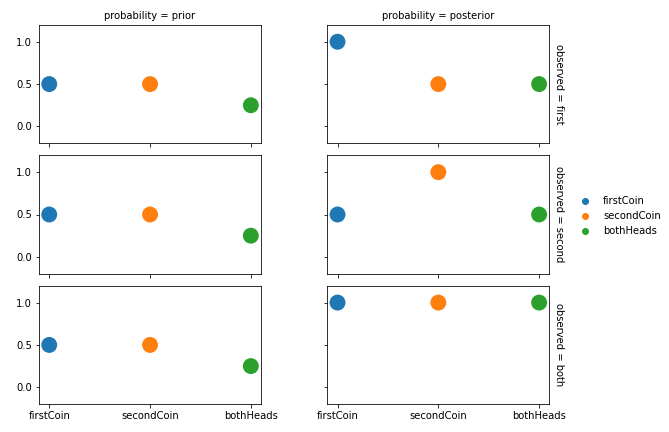
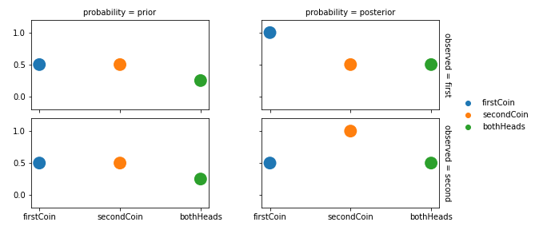
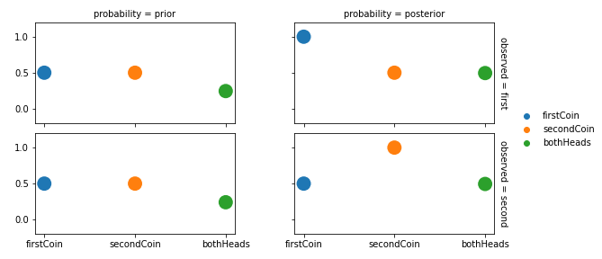

# 0: Base Repo

If you are use to scripting languages like Python, setting up a compiled language project like C# on Linux, Windows or MacOS can be daunting to say the least. Further, getting the dotNet framework to work and then Microsoft's inferDotNot package on top of that creates more barriers to get going coding up the awesome probabilistic models that you can build with the inferDotNet package.

This repo is used as the base repo for projects that have models that are called from python notebooks. You can fork this repo to have a boiler plate setup for a inferDotNet model.

## Installing C# and inferDotNet

Luckily VS Code is also supported (funded) by Microsoft, so they've got some incentive to make it as easy as possible to set up C# and VS Code on Linux, Windows and Mac.

You can install .Net <a href="https://dotnet.microsoft.com/download">here</a>.

Once installed you should be able to run the `dotnet` command in the CLI. If not, refer to the .Net documentation to get to this point.

Once you can run the `dotnet` command, we can easily create a new CLI .Net project with the following:

```bash
dotnet new console
```

This will create all the required C# files required to be able to compile our programs which resides in the `Program.vs` file. We've run `dotnet new console` in <a href="https://github.com/infer-dot-net/0-base-repo/tree/v0.1.0/models/model-1">models/model-1</a> which populates <a href="https://raw.githubusercontent.com/infer-dot-net/0-base-repo/v0.1.0/models/model-1/Program.cs">models/model-1/Program.cs</a> with:

```csharp
using System;

namespace model_1
{
    class Program
    {
        static void Main(string[] args)
        {
            Console.WriteLine("Hello World!");
        }
    }
}
```

Now you should be able to run

```bash
dotnet run
```

in <a href="https://github.com/infer-dot-net/0-base-repo/tree/v0.1.0/models/model-1">models/model-1</a> to get the output:

```log
Hello World!
```

We've versioned up to this point as <a href="">v0.1.0</a>, so you can always restore this repo to just the hello word code whenever you want. However, we are here to build models, so we'll change the content of <a href="./models/model-1/Program.cs">models/model-1/Program.cs</a> to hold a coin flip model example that we'll call from our Jupyter notebook.

## Running inferDotNet

Even though setting up an inferDotNet project should be difficult, most of the times you'll run into some issue with either C#, or dotNet or inferDotNet. That's why this base repo exists. To get you up and running quickly.

You should be able to clone this repo, open it in VS Code and if you've got dotnet installed, once you open the Program.cs file VS Code should pick up the dependencies and ask to install them all and you'll be set to go. You can test this by running

```bash
cd models/model
dotnet run ../../data first EP
```

This should build the basic two coin example we've got and output:

```log
Compiling model...done.

priorFirstCoin : Bernoulli(0.5)
priorSecondCoin: Bernoulli(0.5)
priorBothHeads : Bernoulli(0.25)

postFirstCoin  : Bernoulli(1)
postSecondCoin : Bernoulli(0.5)
postBothHeads  : Bernoulli(0.5)
```

## More on the model

The basic outline of a model we've created is a two coin flipping example. We've got 2 unbiased coins: `firstCoin` and `secondCoin` and we create another random variable `bothHeads` that is true when both `firstCoin` and `secondCoin` is true. We'd like to infer the posterior probability of `bothHead` given we observe one of the other coins, i.e.

<div align='center'>
    
</div>

or

<div align='center'>
    
</div>

We can create random variables for firstCoin, secondCoin and bothHead in inferDotNet using the `Microsoft.ML.Probabilistic.Models` namespace as:

```csharp
M.Variable<bool> firstCoin = M.Variable.Bernoulli(0.5).Named("firstCoin");
M.Variable<bool> secondCoin = M.Variable.Bernoulli(0.5).Named("secondCoin");
M.Variable<bool> bothHeads = (firstCoin & secondCoin).Named("bothHeads");
```

Then we can set our inference engine, i.e. the way that the posterior will be calculated as one of

+ Expectation Propagation - EP
+ Variational Message Passing - VMP
+ Gibbs - Gibbs

Then we can observe a value using the `.ObservedValue` attribute of a random variable as

```csharp
firstCoin.ObservedValue = true;
```

Then we can infer the posterior using the infer engine as

```csharp
D.Bernoulli postFirstCoin = engine.Infer<D.Bernoulli>(firstCoin);
D.Bernoulli postSecondCoin = engine.Infer<D.Bernoulli>(secondCoin);
D.Bernoulli postBothHeads = engine.Infer<D.Bernoulli>(bothHeads);
```


### Expectation Propagation
<div align='center'>
    </img>
</div>

### Variational Message Passing

<div align='center'>
    </img>
</div>

### Gibbs Sampling

<div align='center'>
    </img>
</div>